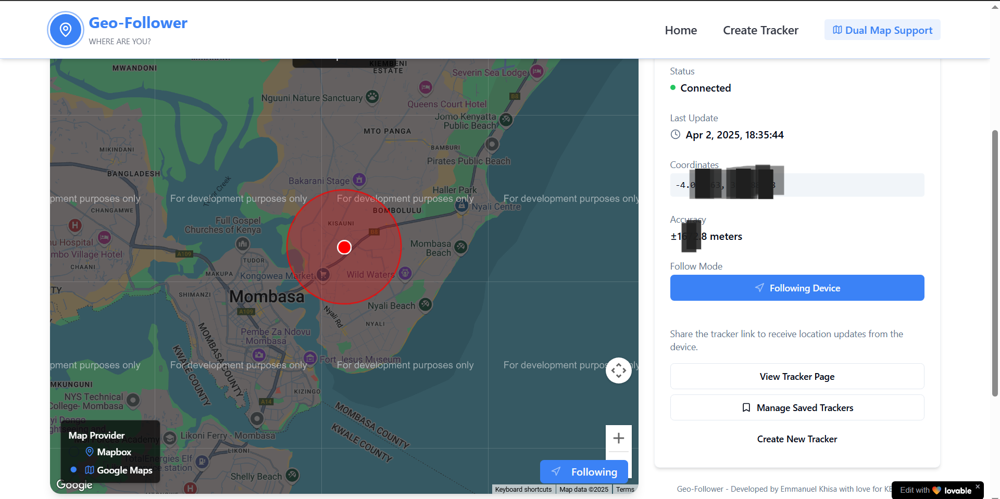
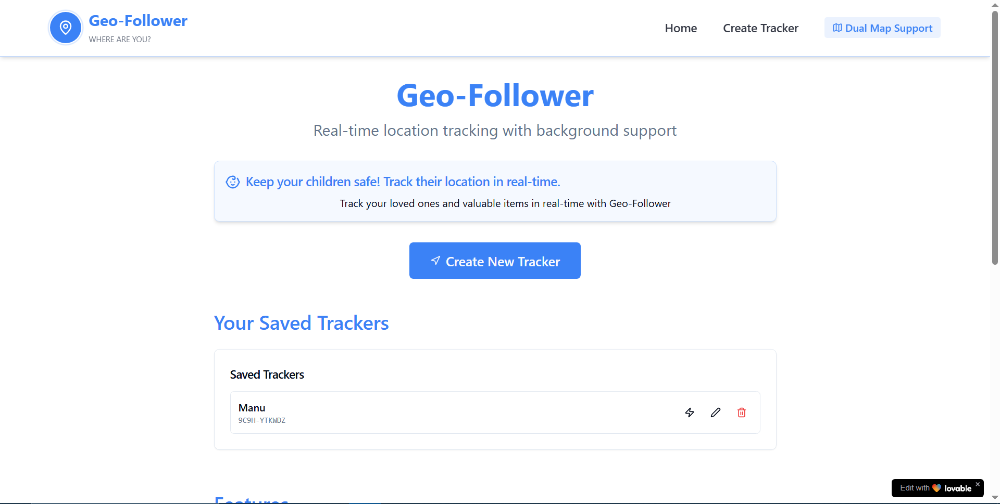

LINK: https://geofollower.netlify.app/

 


## GEOLOCATION FOLLOWER

An open-sorce real-time location tracking application that allows you to create tracking links, monitor device locations, and view them on a map.

Use Wisely

## Development Setup

If you want to work locally using your own IDE, you can clone this repo and push changes. Pushed changes will also be reflected.

The only requirement is having Node.js & npm installed - [install with nvm](https://github.com/nvm-sh/nvm#installing-and-updating)

Follow these steps:

```sh
# Step 1: Clone the repository using the project's Git URL.
git clone https://github.com/Emmanuelkhisa/geo-follower

# Step 2: Navigate to the project directory.
cd geo-follower

# Step 3: Install the necessary dependencies.
npm i

# Step 4: Start the development server with auto-reloading and an instant preview.
npm run dev
```

## Important Setup for Full Functionality

For the application to work properly, you need to:


1. **Run the WebSocket Server** (for real-time location updates in production):
   - A simple WebSocket server is included in `src/server/server.js`
   - Install the WebSocket dependency: `npm install ws`
   - Run the server: `node src/server/server.js`
   - The server will listen on port 8081

## Browser Compatibility

This application requires WebGL support for map rendering. If you encounter map display issues:
- Try using a different browser (Chrome, Firefox, Edge recommended)
- Make sure your device supports WebGL
- Update your graphics drivers if necessary

## How To Use
 - Create a tracking link
 - Share this link with a target device
 - View on map or record all the data using node terminal (instructions in web)
 - Avoid cross-origin location tracing by ensuring the target device has access to the application.

## What technologies are used for this project?

This project is built with:

- Vite
- TypeScript
- React
- shadcn-ui
- Tailwind CSS
- Mapbox GL JS
- WebSockets

## License:
This project is licensed under the MIT License. Feel free to use, modify, and distribute as per the terms of the license.
