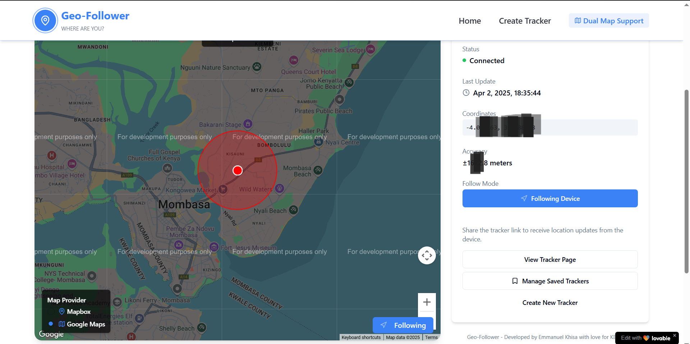

# Geo Follower

[](LICENSE)
[](https://react.dev/)
[](https://www.typescriptlang.org/)
[](https://vitejs.dev/)

**Live Demo**: [https://geofollower.netlify.app/](https://geofollower.netlify.app/)



**Geo Follower** is an open-source real-time location tracking and telemetry application that enables users to generate custom tracking links, monitor target device coordinates with interactive maps, and instantly share tracking links across devices.

---

## ✨ Features

- **📍 Real-Time Location Tracking**: Continuously broadcasts and receives device coordinates (latitude, longitude, accuracy, heading, altitude, speed) using the HTML5 Geolocation API.
- **🔗 Instant Tracker Link Sharing**:
  - One-click copy of the active tracker URL to the clipboard.
  - Interactive toast notifications confirming copy success.
  - Resilient cross-browser clipboard fallback for mobile browsers and sandboxed iframe environments.
  - Quick share buttons accessible directly from the Tracker Header, Map View sidebar, and Tracker Management list.
- **🗺️ Multi-Provider Map Views**:
  - Interactive Mapbox GL JS rendering with custom styling.
  - Integrated Google Maps support with map provider toggle.
  - Live pulse marker indicators, smooth camera transitions, and breadcrumb path history.
- **📊 Live Device Telemetry**:
  - Real-time battery status monitoring (level, charging status).
  - Accuracy radius indicator and signal freshness timestamps.
  - Connection health indicators and reconnect handling.
- **📋 Tracker Management**:
  - Create and name custom trackers.
  - Save, organize, inspect, and remove trackers with local persistence.
- **📱 PWA Ready**:
  - Offline caching and service worker registration for quick launch on mobile devices.

---

## 🚀 Getting Started

### Prerequisites

- [Node.js](https://nodejs.org/) (v18 or higher recommended)
- `npm` or `bun`

### 1. Clone the Repository

```bash
git clone https://github.com/Emmanuelkhisa/geo-follower.git
cd geo-follower
```

### 2. Install Dependencies

```bash
npm install
```

### 3. Start the Development Server

```bash
npm run dev
```

The application will run locally at `http://localhost:3000`.

---

## ⚡ Real-Time WebSocket Server Setup

For live tracking updates between different devices:

1. Install the WebSocket package (if running standalone):
   ```bash
   npm install ws
   ```
2. Start the WebSocket server:
   ```bash
   node src/server/server.js
   ```
   The WebSocket server listens on port `8081` (or your configured `PORT`).

---

## 📖 How to Use

1. **Create a Tracker**:
   - Open the homepage and navigate to **Create Tracker**.
   - Assign a name and generate your unique Tracker ID.
2. **Share the Tracking Link**:
   - Click the **Share Tracker** button or copy the link directly.
   - A toast notification will confirm the URL has been copied to your clipboard.
   - Send the link to the target device or open it in its browser.
3. **Broadcast Location**:
   - On the target device, open the link and grant location access when prompted.
   - The device begins streaming coordinates in real-time.
4. **Monitor on Map**:
   - Open the **Map View** on your monitor device to follow live movement and inspect telemetry.

---

## 🛠️ Tech Stack

- **Framework**: [React 18](https://react.dev/) + [Vite](https://vitejs.dev/)
- **Language**: [TypeScript](https://www.typescriptlang.org/)
- **Styling**: [Tailwind CSS](https://tailwindcss.com/)
- **UI Components**: [shadcn/ui](https://ui.shadcn.com/) & [Radix UI](https://www.radix-ui.com/)
- **Mapping**: [Mapbox GL JS](https://docs.mapbox.com/mapbox-gl-js/) & Google Maps
- **Real-Time Communication**: WebSockets (`ws`)
- **Icons**: [Lucide React](https://lucide.dev/)
- **Notifications**: [Sonner](https://sonner.emilkowal.ski/) & Radix Toast

---

## 🌐 Browser Compatibility & Permissions

- Requires **Geolocation permissions** enabled on the tracking device.
- Requires **WebGL support** for hardware-accelerated map rendering (Google Chrome, Firefox, Safari, and Microsoft Edge supported).
- For local testing on separate mobile devices over LAN, ensure the app is served via HTTPS or `localhost` / `*.localhost` to satisfy secure origin restrictions for the Geolocation API.

---

## 📄 License

This project is licensed under the [MIT License](LICENSE). Feel free to use, modify, and distribute as per the terms of the license.
